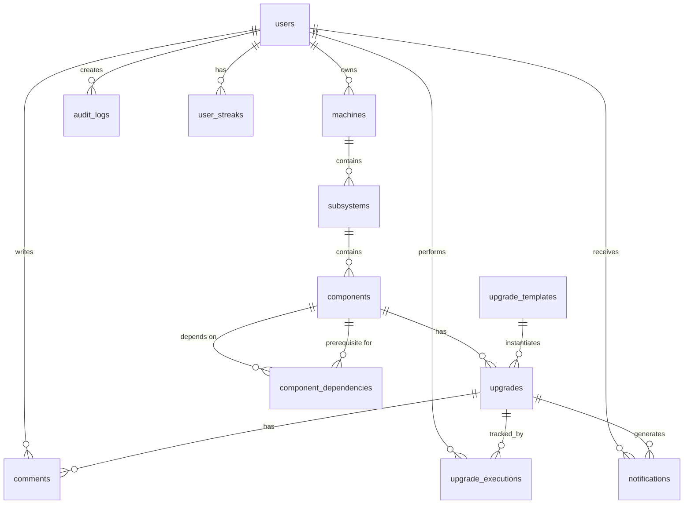

# Design Document: System Sight Workflow Management

## Overview

System Sight is a Laravel-based workflow management system that enables organizations to document, track, and continuously improve their Standard Operating Procedures (SOPs). The system uses a hierarchical tree structure to organize business processes at multiple levels of granularity, from high-level business domains down to specific documented procedures.

The design emphasizes:
- **Hierarchical Organization**: 4-level tree (Machine → Subsystem → Component → Upgrade) for intuitive process organization
- **Health Monitoring**: Visual indicators for process health to quickly identify areas needing attention
- **Continuous Improvement**: Streak tracking and gamification to encourage regular process optimization
- **Collaboration**: Notification system, comments, and shared workflows to enable team coordination
- **Auditability**: Complete audit trail and version history for compliance and accountability

The system is built on Laravel's MVC architecture, leveraging Eloquent ORM for data persistence, Blade templates for views, and Laravel's built-in authentication system for security.

## Architecture

### High-Level Architecture

```
┌─────────────────────────────────────────────────────────────┐
│                        Presentation Layer                    │
│  (Blade Templates, JavaScript, CSS, Mobile-Responsive UI)   │
└─────────────────────────────────────────────────────────────┘
                              │
                              ▼
┌─────────────────────────────────────────────────────────────┐
│                      Application Layer                       │
│         (Controllers, Middleware, Request Validation)        │
└─────────────────────────────────────────────────────────────┘
                              │
                              ▼
┌─────────────────────────────────────────────────────────────┐
│                        Business Logic Layer                  │
│    (Services, Event Handlers, Streak Calculator, Health     │
│     Aggregator, Search Engine, Dependency Validator)        │
└─────────────────────────────────────────────────────────────┐
                              │
                              ▼
┌─────────────────────────────────────────────────────────────┐
│                         Data Layer                           │
│        (Eloquent Models, Repositories, Query Builders)       │
└─────────────────────────────────────────────────────────────┘
                              │
                              ▼
┌─────────────────────────────────────────────────────────────┐
│                      Database (MySQL/PostgreSQL)             │
│   (machines, subsystems, components, upgrades, users,        │
│    notifications, comments, audit_logs, dependencies)        │
└─────────────────────────────────────────────────────────────┘
```

### Design Patterns

1. **MVC (Model-View-Controller)**: Laravel's core pattern for separation of concerns
2. **Repository Pattern**: Abstraction layer for data access to enable testing and flexibility
3. **Service Layer Pattern**: Business logic encapsulation for complex operations
4. **Observer Pattern**: Event-driven notifications and audit logging
5. **Strategy Pattern**: Different health calculation strategies for different entity types
6. **Factory Pattern**: Template creation and workflow instantiation

## Components and Interfaces

### Core Domain Models

#### Machine Model
```php
class Machine extends Model
{
    protected $fillable = ['name', 'description', 'user_id'];
    
    public function subsystems(): HasMany;
    public function user(): BelongsTo;
    public function getHealthMetrics(): array;
    public function getComponentCount(): int;
    public function getUpgradeCount(): int;
}
```

#### Subsystem Model
```php
class Subsystem extends Model
{
    protected $fillable = ['name', 'description', 'machine_id'];
    
    public function machine(): BelongsTo;
    public function components(): HasMany;
    public function getRecentUpgrades(int $limit = 5): Collection;
    public function getHealthMetrics(): array;
}
```

#### Component Model
```php
class Component extends Model
{
    protected $fillable = ['name', 'description', 'subsystem_id', 'health_status'];
    protected $casts = ['health_status' => ComponentHealthStatus::class];
    
    public function subsystem(): BelongsTo;
    public function upgrades(): HasMany;
    public function dependencies(): BelongsToMany;
    public function dependents(): BelongsToMany;
    public function getActiveUpgrade(): ?Upgrade;
    public function getExecutionFrequency(): float;
}
```

#### Upgrade Model
```php
class Upgrade extends Model
{
    protected $fillable = [
        'name', 'purpose', 'trigger', 'steps', 
        'definition_of_done', 'component_id', 'is_active', 'shipped_at'
    ];
    protected $casts = [
        'shipped_at' => 'datetime',
        'is_active' => 'boolean'
    ];
    
    public function component(): BelongsTo;
    public function comments(): HasMany;
    public function executions(): HasMany;
    public function ship(): void;
    public function markAsExecuted(User $user): UpgradeExecution;
}
```

### Supporting Models

#### Notification Model
```php
class Notification extends Model
{
    protected $fillable = [
        'user_id', 'type', 'notifiable_type', 'notifiable_id', 
        'data', 'read_at'
    ];
    protected $casts = [
        'data' => 'array',
        'read_at' => 'datetime'
    ];
    
    public function user(): BelongsTo;
    public function notifiable(): MorphTo;
    public function markAsRead(): void;
}
```

#### Comment Model
```php
class Comment extends Model
{
    protected $fillable = ['upgrade_id', 'user_id', 'content'];
    
    public function upgrade(): BelongsTo;
    public function user(): BelongsTo;
    public function mentions(): array;
}
```

#### AuditLog Model
```php
class AuditLog extends Model
{
    protected $fillable = [
        'user_id', 'auditable_type', 'auditable_id', 
        'action', 'old_values', 'new_values'
    ];
    protected $casts = [
        'old_values' => 'array',
        'new_values' => 'array'
    ];
    
    public function user(): BelongsTo;
    public function auditable(): MorphTo;
}
```

#### UpgradeExecution Model
```php
class UpgradeExecution extends Model
{
    protected $fillable = ['upgrade_id', 'user_id', 'executed_at'];
    protected $casts = ['executed_at' => 'datetime'];
    
    public function upgrade(): BelongsTo;
    public function user(): BelongsTo;
}
```

#### ComponentDependency Model
```php
class ComponentDependency extends Model
{
    protected $fillable = ['component_id', 'prerequisite_component_id'];
    
    public function component(): BelongsTo;
    public function prerequisite(): BelongsTo;
}
```

#### UpgradeTemplate Model
```php
class UpgradeTemplate extends Model
{
    protected $fillable = [
        'name', 'description', 'purpose_template', 
        'trigger_template', 'steps_template', 'definition_of_done_template'
    ];
    
    public function instantiate(Component $component): Upgrade;
}
```

### Enums

#### ComponentHealthStatus Enum
```php
enum ComponentHealthStatus: string
{
    case SMOOTH = 'smooth';
    case ON_FIRE = 'on_fire';
    case NEEDS_LOVE = 'needs_love';
    
    public function getIcon(): string
    {
        return match($this) {
            self::SMOOTH => '✅',
            self::ON_FIRE => '🔥',
            self::NEEDS_LOVE => '💛',
        };
    }
}
```

### Service Layer

#### StreakService
```php
class StreakService
{
    public function getCurrentStreak(User $user): int;
    public function updateStreak(User $user): void;
    public function calculateWeekBoundaries(): array;
    public function hasShippedThisWeek(User $user): bool;
}
```

#### HealthAggregatorService
```php
class HealthAggregatorService
{
    public function calculateMachineHealth(Machine $machine): array;
    public function calculateSubsystemHealth(Subsystem $subsystem): array;
    public function getHealthDistribution(Collection $components): array;
}
```

#### SearchService
```php
class SearchService
{
    public function search(string $query): array;
    public function searchMachines(string $query): Collection;
    public function searchSubsystems(string $query): Collection;
    public function searchComponents(string $query): Collection;
    public function searchUpgrades(string $query): Collection;
}
```

#### DependencyValidatorService
```php
class DependencyValidatorService
{
    public function validateDependency(Component $component, Component $prerequisite): bool;
    public function detectCircularDependency(Component $component, Component $prerequisite): bool;
    public function getUnmetPrerequisites(Component $component): Collection;
}
```

#### NotificationService
```php
class NotificationService
{
    public function notifyUpgradeShipped(Upgrade $upgrade): void;
    public function notifyUpgradeCreated(Upgrade $upgrade): void;
    public function notifyUpgradeEdited(Upgrade $upgrade): void;
    public function notifyCommentMention(Comment $comment, User $mentionedUser): void;
}
```

#### AuditService
```php
class AuditService
{
    public function logCreate(Model $model, User $user): void;
    public function logUpdate(Model $model, User $user, array $oldValues, array $newValues): void;
    public function logDelete(Model $model, User $user): void;
    public function getAuditHistory(Model $model): Collection;
}
```

#### ExportService
```php
class ExportService
{
    public function exportMachine(Machine $machine): string;
    public function exportSubsystem(Subsystem $subsystem): string;
    public function exportComponent(Component $component): string;
    public function exportToJson(Model $entity): string;
}
```

#### ImportService
```php
class ImportService
{
    public function importFromJson(string $json, User $user): Model;
    public function validateJsonStructure(array $data): bool;
    public function preventDuplicates(array $data): bool;
}
```

### Controllers

#### DashboardController
```php
class DashboardController extends Controller
{
    public function index(): View;
}
```

#### MachineController
```php
class MachineController extends Controller
{
    public function index(): View;
    public function show(Machine $machine): View;
    public function create(): View;
    public function store(StoreMachineRequest $request): RedirectResponse;
    public function edit(Machine $machine): View;
    public function update(UpdateMachineRequest $request, Machine $machine): RedirectResponse;
    public function destroy(Machine $machine): RedirectResponse;
}
```

#### SubsystemController
```php
class SubsystemController extends Controller
{
    public function show(Subsystem $subsystem): View;
    public function create(Machine $machine): View;
    public function store(StoreSubsystemRequest $request): RedirectResponse;
    public function edit(Subsystem $subsystem): View;
    public function update(UpdateSubsystemRequest $request, Subsystem $subsystem): RedirectResponse;
    public function destroy(Subsystem $subsystem): RedirectResponse;
}
```

#### ComponentController
```php
class ComponentController extends Controller
{
    public function show(Component $component): View;
    public function create(Subsystem $subsystem): View;
    public function store(StoreComponentRequest $request): RedirectResponse;
    public function edit(Component $component): View;
    public function update(UpdateComponentRequest $request, Component $component): RedirectResponse;
    public function destroy(Component $component): RedirectResponse;
    public function updateHealthStatus(UpdateHealthStatusRequest $request, Component $component): RedirectResponse;
}
```

#### UpgradeController
```php
class UpgradeController extends Controller
{
    public function create(Component $component): View;
    public function store(StoreUpgradeRequest $request): RedirectResponse;
    public function edit(Upgrade $upgrade): View;
    public function update(UpdateUpgradeRequest $request, Upgrade $upgrade): RedirectResponse;
    public function destroy(Upgrade $upgrade): RedirectResponse;
    public function ship(Upgrade $upgrade): RedirectResponse;
    public function markAsExecuted(Upgrade $upgrade): RedirectResponse;
}
```

#### SearchController
```php
class SearchController extends Controller
{
    public function search(SearchRequest $request): View;
}
```

#### NotificationController
```php
class NotificationController extends Controller
{
    public function index(): View;
    public function markAsRead(Notification $notification): RedirectResponse;
    public function markAllAsRead(): RedirectResponse;
}
```

#### CommentController
```php
class CommentController extends Controller
{
    public function store(StoreCommentRequest $request, Upgrade $upgrade): RedirectResponse;
    public function update(UpdateCommentRequest $request, Comment $comment): RedirectResponse;
    public function destroy(Comment $comment): RedirectResponse;
}
```

#### ExportController
```php
class ExportController extends Controller
{
    public function exportMachine(Machine $machine): Response;
    public function exportSubsystem(Subsystem $subsystem): Response;
    public function exportComponent(Component $component): Response;
}
```

#### ImportController
```php
class ImportController extends Controller
{
    public function import(ImportRequest $request): RedirectResponse;
}
```

## Data Models

### Database Schema

#### machines table
```sql
CREATE TABLE machines (
    id BIGINT UNSIGNED PRIMARY KEY AUTO_INCREMENT,
    user_id BIGINT UNSIGNED NOT NULL,
    name VARCHAR(255) NOT NULL,
    description TEXT,
    created_at TIMESTAMP,
    updated_at TIMESTAMP,
    FOREIGN KEY (user_id) REFERENCES users(id) ON DELETE CASCADE,
    INDEX idx_user_id (user_id)
);
```

#### subsystems table
```sql
CREATE TABLE subsystems (
    id BIGINT UNSIGNED PRIMARY KEY AUTO_INCREMENT,
    machine_id BIGINT UNSIGNED NOT NULL,
    name VARCHAR(255) NOT NULL,
    description TEXT,
    created_at TIMESTAMP,
    updated_at TIMESTAMP,
    FOREIGN KEY (machine_id) REFERENCES machines(id) ON DELETE CASCADE,
    INDEX idx_machine_id (machine_id)
);
```

#### components table
```sql
CREATE TABLE components (
    id BIGINT UNSIGNED PRIMARY KEY AUTO_INCREMENT,
    subsystem_id BIGINT UNSIGNED NOT NULL,
    name VARCHAR(255) NOT NULL,
    description TEXT,
    health_status ENUM('smooth', 'on_fire', 'needs_love') DEFAULT 'smooth',
    created_at TIMESTAMP,
    updated_at TIMESTAMP,
    FOREIGN KEY (subsystem_id) REFERENCES subsystems(id) ON DELETE CASCADE,
    INDEX idx_subsystem_id (subsystem_id),
    INDEX idx_health_status (health_status)
);
```

#### upgrades table
```sql
CREATE TABLE upgrades (
    id BIGINT UNSIGNED PRIMARY KEY AUTO_INCREMENT,
    component_id BIGINT UNSIGNED NOT NULL,
    name VARCHAR(255) NOT NULL,
    purpose TEXT NOT NULL,
    trigger TEXT NOT NULL,
    steps TEXT NOT NULL,
    definition_of_done TEXT NOT NULL,
    is_active BOOLEAN DEFAULT FALSE,
    shipped_at TIMESTAMP NULL,
    created_at TIMESTAMP,
    updated_at TIMESTAMP,
    FOREIGN KEY (component_id) REFERENCES components(id) ON DELETE CASCADE,
    INDEX idx_component_id (component_id),
    INDEX idx_is_active (is_active),
    INDEX idx_shipped_at (shipped_at)
);
```

#### notifications table
```sql
CREATE TABLE notifications (
    id BIGINT UNSIGNED PRIMARY KEY AUTO_INCREMENT,
    user_id BIGINT UNSIGNED NOT NULL,
    type VARCHAR(255) NOT NULL,
    notifiable_type VARCHAR(255) NOT NULL,
    notifiable_id BIGINT UNSIGNED NOT NULL,
    data JSON,
    read_at TIMESTAMP NULL,
    created_at TIMESTAMP,
    updated_at TIMESTAMP,
    FOREIGN KEY (user_id) REFERENCES users(id) ON DELETE CASCADE,
    INDEX idx_user_id (user_id),
    INDEX idx_notifiable (notifiable_type, notifiable_id),
    INDEX idx_read_at (read_at)
);
```

#### comments table
```sql
CREATE TABLE comments (
    id BIGINT UNSIGNED PRIMARY KEY AUTO_INCREMENT,
    upgrade_id BIGINT UNSIGNED NOT NULL,
    user_id BIGINT UNSIGNED NOT NULL,
    content TEXT NOT NULL,
    created_at TIMESTAMP,
    updated_at TIMESTAMP,
    FOREIGN KEY (upgrade_id) REFERENCES upgrades(id) ON DELETE CASCADE,
    FOREIGN KEY (user_id) REFERENCES users(id) ON DELETE CASCADE,
    INDEX idx_upgrade_id (upgrade_id),
    INDEX idx_user_id (user_id)
);
```

#### audit_logs table
```sql
CREATE TABLE audit_logs (
    id BIGINT UNSIGNED PRIMARY KEY AUTO_INCREMENT,
    user_id BIGINT UNSIGNED NOT NULL,
    auditable_type VARCHAR(255) NOT NULL,
    auditable_id BIGINT UNSIGNED NOT NULL,
    action VARCHAR(50) NOT NULL,
    old_values JSON,
    new_values JSON,
    created_at TIMESTAMP,
    FOREIGN KEY (user_id) REFERENCES users(id) ON DELETE CASCADE,
    INDEX idx_user_id (user_id),
    INDEX idx_auditable (auditable_type, auditable_id),
    INDEX idx_action (action),
    INDEX idx_created_at (created_at)
);
```

#### upgrade_executions table
```sql
CREATE TABLE upgrade_executions (
    id BIGINT UNSIGNED PRIMARY KEY AUTO_INCREMENT,
    upgrade_id BIGINT UNSIGNED NOT NULL,
    user_id BIGINT UNSIGNED NOT NULL,
    executed_at TIMESTAMP NOT NULL,
    created_at TIMESTAMP,
    updated_at TIMESTAMP,
    FOREIGN KEY (upgrade_id) REFERENCES upgrades(id) ON DELETE CASCADE,
    FOREIGN KEY (user_id) REFERENCES users(id) ON DELETE CASCADE,
    INDEX idx_upgrade_id (upgrade_id),
    INDEX idx_user_id (user_id),
    INDEX idx_executed_at (executed_at)
);
```

#### component_dependencies table
```sql
CREATE TABLE component_dependencies (
    id BIGINT UNSIGNED PRIMARY KEY AUTO_INCREMENT,
    component_id BIGINT UNSIGNED NOT NULL,
    prerequisite_component_id BIGINT UNSIGNED NOT NULL,
    created_at TIMESTAMP,
    updated_at TIMESTAMP,
    FOREIGN KEY (component_id) REFERENCES components(id) ON DELETE CASCADE,
    FOREIGN KEY (prerequisite_component_id) REFERENCES components(id) ON DELETE CASCADE,
    UNIQUE KEY unique_dependency (component_id, prerequisite_component_id),
    INDEX idx_component_id (component_id),
    INDEX idx_prerequisite_component_id (prerequisite_component_id)
);
```

#### upgrade_templates table
```sql
CREATE TABLE upgrade_templates (
    id BIGINT UNSIGNED PRIMARY KEY AUTO_INCREMENT,
    name VARCHAR(255) NOT NULL,
    description TEXT,
    purpose_template TEXT NOT NULL,
    trigger_template TEXT NOT NULL,
    steps_template TEXT NOT NULL,
    definition_of_done_template TEXT NOT NULL,
    created_at TIMESTAMP,
    updated_at TIMESTAMP,
    INDEX idx_name (name)
);
```

#### user_streaks table
```sql
CREATE TABLE user_streaks (
    id BIGINT UNSIGNED PRIMARY KEY AUTO_INCREMENT,
    user_id BIGINT UNSIGNED NOT NULL,
    current_streak INT DEFAULT 0,
    last_ship_date DATE,
    created_at TIMESTAMP,
    updated_at TIMESTAMP,
    FOREIGN KEY (user_id) REFERENCES users(id) ON DELETE CASCADE,
    UNIQUE KEY unique_user_streak (user_id)
);
```

### Data Relationships



